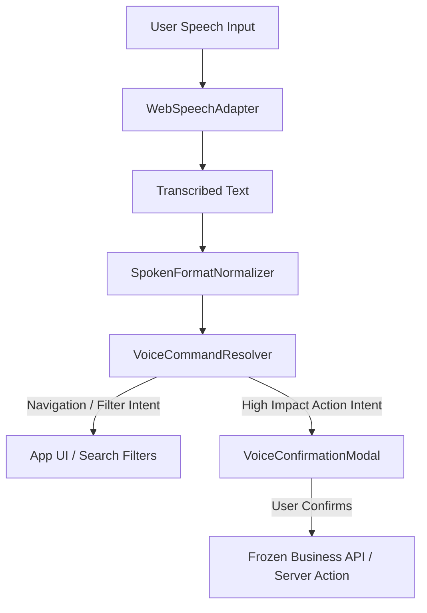

# KRISHISETU (कृषीseतू) — PHASE 11: VOICE-FIRST INTERACTION LAYER

## 1. Overview
Phase 11 introduces a **voice-first interaction layer** built directly on top of KrishiSetu's frozen domain models and APIs (Phases 1–10). Designed for farmers with low digital literacy or limited typing proficiency, voice acts purely as an input method / UI shortcut without bypassing any authentication, authorization, Zod validation, or transaction safety gates.

> [!IMPORTANT]
> **No AI Agent / No Autonomous Execution**: Phase 11 is strictly a voice interaction interface layer. High-impact actions (creating listings, accepting offers, generating orders, booking transport/storage) **always** require explicit user confirmation via UI modals.

---

## 2. Browser & Language Limitations
> [!NOTE]
> KrishiSetu requests `en-IN`, `hi-IN`, and `mr-IN` through the browser Web Speech API. Actual speech recognition availability, accuracy, and accent comprehension depend entirely on individual browser and device support.

---

## 3. Privacy & Audio Data Governance
> [!IMPORTANT]
> KrishiSetu does not record, store, or persist raw microphone audio. Voice recognition is delegated to the browser's native Web Speech API, whose processing behaviour may vary by browser/device.

- **No Microphone Leaks**: Permission is managed natively by the browser when `recognition.start()` is invoked upon explicit user tap. Direct `getUserMedia()` media streams are not retained or created unnecessarily.
- **Safety Timeout**: `WebSpeechAdapter` includes an explicit 10-second max duration safety timeout (`timeoutTimer`) that automatically terminates listening sessions if speech end events are delayed.

---

## 4. Architecture & Components

### Core Modules
1. **`IVoiceRecognitionProvider` & `WebSpeechAdapter`** (`src/lib/voice/`)
   - Decoupled abstraction wrapping the browser-native `Web Speech API` (`SpeechRecognition` / `webkitSpeechRecognition`).
   - Supports locales: English (`en-IN`), Hindi (`hi-IN`), Marathi (`mr-IN`).
   - Handles standard error codes: `NOT_SUPPORTED`, `PERMISSION_DENIED`, `NO_SPEECH`, `NETWORK_ERROR`.

2. **`VoiceCommandResolver`** (`src/lib/voice/VoiceCommandResolver.ts`)
   - Deterministic phrase matching for navigation (`/marketplace`, `/my-listings`, `/offers`, `/orders`, `/notifications`, `/profile`, `/weather`, `/market-intelligence`, `/transport/discover`, `/storage/discover`).
   - Intent & entity extraction for crop search and mandi queries.
   - Ambiguous input returns `UNRESOLVED` with `0` confidence score (no guessing or hallucinations).

3. **`SpokenFormatNormalizer`** (`src/lib/voice/SpokenFormatNormalizer.ts`)
   - Normalizes spoken regional quantities and prices across Marathi (पाचशे -> 500, हजार -> 1000, क्विंटल -> Quintal), Hindi (पांच सौ -> 500, एक हजार -> 1000), and English (five hundred -> 500).
   - Employs whitespace-bounded regex matching (`\s`) to support Devanagari non-Latin script parsing.

4. **UI Components** (`src/components/voice/`)
   - `VoiceInput`: Inline mic button with listening state indicators (🔴 Listening, ⏳ Processing, 📝 Preview), ARIA live region updates, `[Use] [Edit] [Cancel]` controls, and fallback text input.
   - `VoiceActionBar`: Global header search/voice bar integrated into `Navbar.tsx`.
   - `VoiceConfirmationModal`: Safety modal displaying intent details and requiring explicit button tap before dispatching high-impact actions.

---

## 5. Weather Integration Status
- **Global Navigation Integration**: Weather is fully integrated into the global voice command resolver and `VoiceActionBar` header bar. Spoken phrases such as *"weather"*, *"मौसम"*, or *"हवामान"* navigate directly to `/weather`.
- **Inline Page Integration**: The `/weather` page uses standard dropdown district selection and does **not** include an inline `VoiceInput` widget.

---

## 6. Verification Results

### Automated Audit Suite
- **Phase 11 Audit**: **39/39 Phase 11 audit tests passed (100% pass rate)**.
- **Full Regression Suite (Phases 4–10)**: **178/178 tests passed**.
